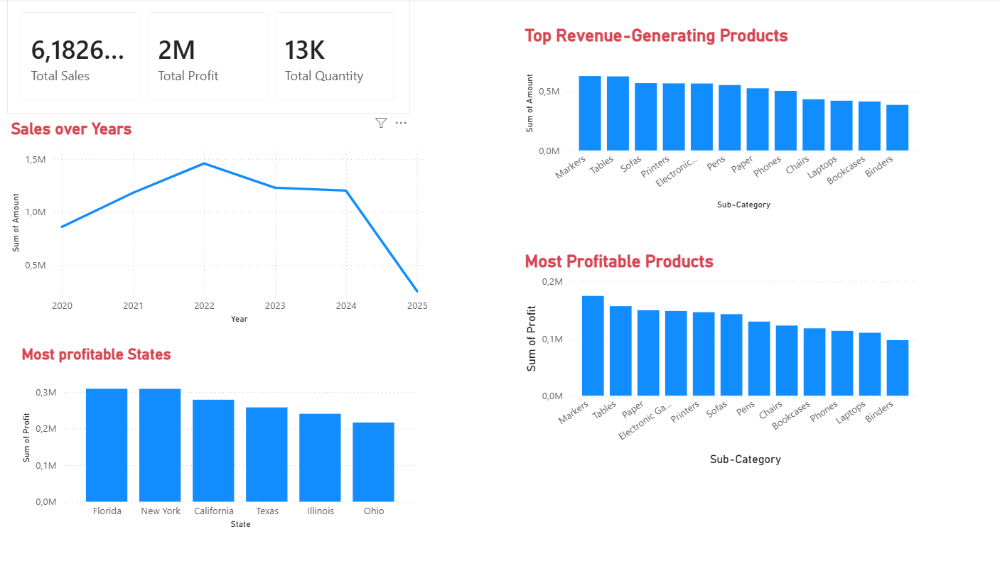

# sales-performance-dashboard
Power BI dashboard analyzing sales, profit, product performance, regional trends, and business recommendations.

---

## Dashboard Preview

---

## Business Questions

- How is the company performing overall?
- Which products generate the most revenue?
- Which products generate the most profit?
- Which states generate the highest profit?
- How do sales change over time?

---

## Key Insights

1. Markers and Tables generated the highest sales and profit, making them the strongest-performing products.

2. Ohio generated the lowest profit among all states and requires further investigation.

3. Paper generated higher profit than expected relative to its sales performance, indicating a potential growth opportunity.

---

## Recommendations

1. Continue investing in high-performing products such as Markers and Tables.

2. Investigate factors affecting profitability in Ohio.

3. Review the performance of Binders and determine whether improvement, repositioning, or discontinuation is appropriate.

---

## Tools Used

- Power BI
- Data Visualization
- Business Analysis
- Dashboard Design

---

## Project Files

- `Project01.pbix` – Power BI dashboard file
- `Dashboard.png` – Dashboard screenshot
